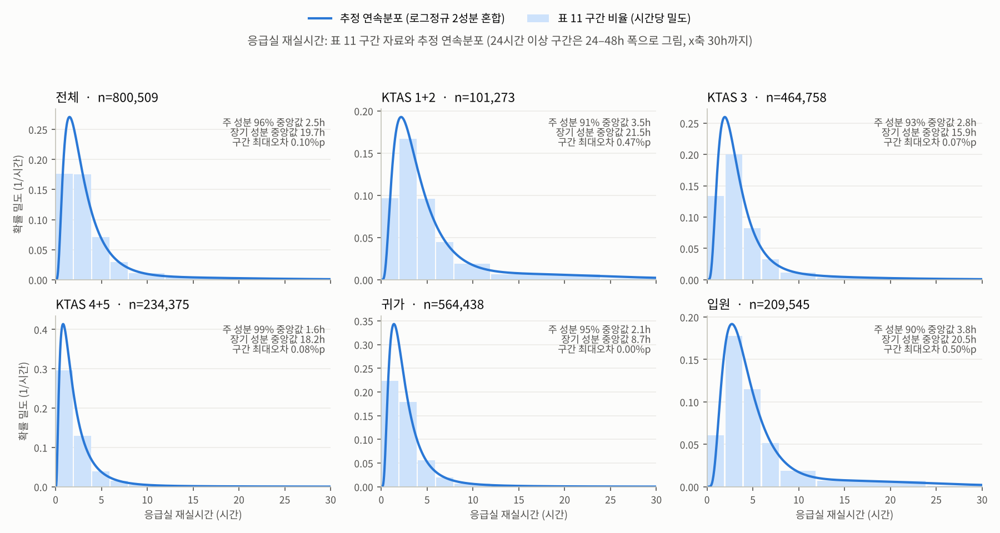

# 환자 발생 확률표와 시뮬레이션 반영 — 2024 응급의료 통계연보 실측 기반 (2026-10-06~07, 10차)

10차 변경의 상세 문서다. 6일에 확률표를 만들고, 7일에 남은 결정을 받아 `sim.js`·`index.html`에 연결했다 (7장). 환자 발생 코드도 이번부터 민성이 맡는다. git 커밋은 하지 않았다 (팀원 리뷰 후 사용자가 커밋).

## 1. 이번에 만든 것

| 파일 | 내용 | 기존 파일 영향 |
|---|---|---|
| `scripts/6_build_patient_probabilities.py` | 통계연보 원시 건수 → 확률표 생성 | 없음. `bed_detail_raw.json`은 읽기만 함 |
| `scripts/6b_validate_patient_probabilities.py` | 합계·비율·IPF 재현 자체 검증 | 없음 |
| `scripts/6c_montecarlo_sampler_check.js` | 샘플러 100만 명 몬테카를로 검증 (node) | 없음 |
| `data/patient_probabilities.json` | 확률표 (출처·실측/가정 표기 포함) | 신규 |
| `data/patient_probabilities.data.js` | 같은 내용, `window.PATIENT_PROBABILITIES` (file:// 실행용) | 신규 |
| `data/patient_probabilities_validation.json` | 검증 결과 | 신규 |
| `patient_profile_sampler.js` | 확률표로 환자 1명을 뽑는 함수 | 신규, index.html에서 sim.js 앞에 로드 |
| `scripts/6d_build_hospital_icu_columns.py` | 병원별 ICU 9종·소아 응급실 병상 추출 | 없음. `bed_detail_raw.json` 읽기만 함 |
| `data/hospital_icu_columns.data.js` | `window.HOSPITAL_ICU_COLUMNS` (hpid 키) | 신규 |
| `docs/img/er_los_distribution.png` | 응급실 재실시간 추정 분포 그림 | 신규 |
| `sim.js`, `index.html` | 확률표 연결 (7장) | **수정** |
| `scripts/5_bundle_standalone_html.js` | 새 로컬 스크립트까지 인라인, 기본 출력 `seoul_er_dispatch_map_7.html` | **수정** |

재생성: `python scripts/6_build_patient_probabilities.py` → `python scripts/6b_validate_patient_probabilities.py` → `node scripts/6c_montecarlo_sampler_check.js` → `python scripts/6d_build_hospital_icu_columns.py` → `node scripts/5_bundle_standalone_html.js` (6번은 scipy 필요)

`1d → 1e → 1f` 파이프라인, `hospitals.json`, 경로 캐시, `isHospitalEligible()`·`selectHospital()`·`buildContactCandidates()`는 건드리지 않았다.

## 2. 확정한 결정 (2026-10-06)

| 항목 | 결정 |
|---|---|
| 모집단 | **119구급차 내원** (표 8). 표 8에 없는 것(시간대, ICU 확률, 재실시간)은 전체 내원 표를 쓰고 "가정"으로 표시 |
| 결합 순서 | **시간대 → KTAS → 연령** |
| ICU 불필요 환자의 requiredSpecialty | **연령으로 소아/성인만 구분** (15세 미만 → 소아 응급실, 15세 이상 → 성인 응급실) |
| ICU 재실일수 | **문헌값으로 가정** (HIRA 중환자실 적정성 평가) |
| 진료계열 | 신생아, 소아, 일반, 내과, 외과, 신경외과, 심장내과, 흉부외과, 신경과 (9개). 외상·음압격리·화상 제외 |
| 비교 입력 | 월·요일 제외. 시간대·KTAS·연령·재실시간만 |
| 도착률 (10-07) | **전체 내원 건수**(800,599건/366일 × 시간대 비중). 프로필은 119 분포 그대로 → 중증 환자 수요는 과대(7장 한계) |
| 소아 응급 환자 (10-07) | **소아 응급실 병상이 있는 병원만** 허용 (51곳 중 33곳) |
| 응급실 재실시간 (10-07) | **표 11에서 연속분포 추정** (4-5장) |
| 소아 ICU (10-07) | **응급전용병상 소아중환자실 16병상 포함** → 소아 ICU 190병상, 10곳 |
| ICU 점유 (10-07) | **응급실 퇴실 후 ICU 단계** — 배정 때 ICU 확보, 응급실 재실 + (수술) + ICU 재실일수 동안 점유 |
| ICU 초기 가동률 (10-07) | **문헌값 72.9%** (화면에서 조절) |
| 수술실 시간 (10-07) | **문헌값**: 응급수술 마취시간 평균 191분 |

## 3. 정정 사항 (인수인계 문서 대비)

1. **ICU·수술 후 입원 건수는 '표 13'이 아니라 '표 12(계속)'이다.** 일반병실/중환자실/수술(시술) 후 병실/수술(시술) 후 중환자실 열은 `12) 서울 응급진료결과(계속)`의 입원 세부 열이다 (PDF 19쪽, 연보 283쪽). `13) 서울 입원 후 결과`는 입원 이후 퇴원·사망을 다루는 다른 표라 쓰지 않았다. 숫자 자체(51,763 / 29,561 / 16,544 / 992 / 4,505 등)는 PDF 원본과 일치했고, 같은 표에 **입원 '기타' 열(161 / 318 / 48)** 이 하나 더 있다.
2. **`icu_buckets()` 확인 완료.** `scripts/1e_apply_manual_bed_detail.py` 86–96행:
   `외상 = 외과 + 신경외과 + 화상 + 외상전용병상.중환자실`. 51곳 모두 **화상 값이 비어 있어(0)** 합이 543 + 339 + 0 + 52 = 934로 맞는다. 심장 404 = 심장내과 220 + 흉부외과 184, 일반 1,171 = 일반 861 + 신경과 66 + 음압격리 244, 소아 945 = 소아 174 + 신생아 755 + 응급전용병상.소아중환자실 16.
3. **기존 코드의 오타 하나**: `sim.js` 151행 `RESOURCE_NEED_PROBABILITIES_BY_KTAS.critical.both`가 `4506/101287`인데 원본은 **4,505**다. 이번 확률표는 원본 값으로 다시 계산했다 (연결하면 이 상수는 더 이상 쓰이지 않음).
4. 기존 버킷에도, 새 9종에도 **들어가지 않는 ICU 자원**: 응급전용병상 중환자실 247 (+ 음압격리 25, 일반격리 34), 외상전용병상 중환자실 52, 중환자실 음압격리 244. 모두 "범위 밖" 자원으로 둔다.
5. 표 11의 합계가 800,509인 것은 오류가 아니라 **재실시간 '미상' 열 90건**이 있기 때문이다.

## 4. 확률표 단계별 출처와 실측/가정 구분

모든 확률은 **건수로 다시 계산**했다 (표의 백분율은 쓰지 않음). 출처: 2024 응급의료 통계연보(제23호) 서울 편, 센터급 이상 서울 응급의료기관 31개소, 800,599건. **시뮬레이션은 51개소라 모집단이 다르다.**

| 단계 | JSON 키 | 쓰는 표 | 구분 |
|---|---|---|---|
| ① 시간대별 도착률 | `arrival` | 표 3 (전체 내원 시간대) | **가정**: 119의 시간대 분포가 없어 전체 내원으로 대리 |
| ② 시간대 → KTAS 그룹 | `ktasGroupByBand` | 표 3 시간×KTAS, 표 3 시간×연령, 표 9 KTAS×연령 → 표 8 119 | 상관구조·주변분포는 **실측**, 결합 방법(IPF)은 **가정** |
| ③ (시간대, KTAS) → 연령 | `ageByBandKtasGroup` | 위와 같은 결합표 | 위와 같음 |
| ③' (KTAS 그룹, 연령) → KTAS 레벨 | `ktasLevelByGroupAge` | 표 9 | **실측**(전체 내원). 119에 같은 그룹 내 분할 적용은 가정 |
| ④ (KTAS, 연령) → 응급진료결과 | `dispositionByKtasGroupAge` | 표 9 KTAS×결과, 표 12(계속) 입원 세부 KTAS 행·연령 행, 표 12 결과 연령 행 | 2원표 3개 모두 **실측**, IPF 결합은 **가정**. 119에 전체 내원 조건부 확률 적용은 **가정** |
| ⑤ ICU 필요 → ICU 종류 | `icuTypeByAge` | `bed_detail_raw.json` (응급똑똑 실측) | 연령 분기는 실측 연령군. 성인 7종 비율은 **병상 공급 비례 가정** |
| ⑥ 응급실 재실시간 | `erLosByKtasGroupAgeResult` | 표 11 KTAS×재실·연령×재실·결과×재실 + ④ | 구간 비율은 **실측**(4원 결합은 **가정**), 구간 안 모양은 **추정 연속분포**(4-5장). 상한 168h **가정** |
| ⑦ ICU 재실일수 | `icuLosDays` | HIRA 2023년(4차) 중환자실 적정성 평가 [표6] | **외부 실측**(전국 성인 ICU). 서울 119·신생아·소아에 적용은 **가정** |
| ⑧ 수술실 점유시간 | `orDurationMin` | Yu 외(2026) 응급수술 마취시간 평균 191.05분 | 평균은 **외부 실측**(중국 단일기관), 로그정규 모양·분산(σ=0.5)은 **가정** |
| ⑨ ICU 초기 가동률 | `icuInitialOccupancy` | Cho 외(2021) 전국 ICU 병상 점유율 2019년 72.9% | **외부 실측**(전국). 서울 51곳 시작 상태에 적용은 **가정** |

### 4-1. ④가 KTAS만이 아니라 (KTAS, 연령)에 달린 이유

처음 설계(인수인계 4장)는 "ICU 필요 확률은 KTAS로만 정하고 연령은 분기·보정에만"이었다. 그런데 검증해 보니 KTAS만으로 정하면 **1–14세 ICU 입원율이 3.34%로 나와 실측 0.37%의 9배**가 됐다 (65세 이상은 5.61% vs 실측 7.64%로 과소). 소아는 KTAS 3이 많지만 ICU로 거의 안 간다. 표 12(계속)에 **연령 행이 있어서** KTAS×처치와 연령×처치를 둘 다 맞추는 IPF로 바꿨다. 이제 연령별 ICU율이 실측과 정확히 맞는다.

### 4-2. 시간대·KTAS·연령 결합

3원 교차표는 없다. 처음 안(시간→KTAS, KTAS→연령 사슬)은 "KTAS가 주어지면 시간과 연령은 독립"이라는 가정이 들어가는데, 이렇게 하면 시간대별 65세 이상 비중이 하루 종일 36~37%로 평평해진다 (실측은 새벽 22% ~ 오전 49%). 그래서 **표 3 시간×KTAS, 표 3 시간×연령, 표 9 KTAS×연령 세 2원표를 동시에 맞추는 IPF**로 결합표를 만들고, 그것을 119 주변분포(표 8 KTAS·연령, 표 3 시간대 비중)로 다시 맞췄다. 남는 가정은 "3원 상호작용이 없다(교차비가 일정하다)"는 것 하나다. 샘플링 순서는 결정대로 시간대 → KTAS → 연령이다.

### 4-3. 성인 ICU 7종 비율 (가정, 병상 공급 비례)

| 중환자실 | 병상 | 비율 |
|---|---|---|
| 일반 | 861 | 30.75% |
| 내과 | 587 | 20.96% |
| 외과 | 543 | 19.39% |
| 신경외과 | 339 | 12.11% |
| 심장내과 | 220 | 7.86% |
| 흉부외과 | 184 | 6.57% |
| 신경과 | 66 | 2.36% |
| 합계 | 2,800 | 100% |

- 수요를 공급에 맞춰 만들었으므로 **종류별 병상 부족이 구조적으로 나오기 어렵다.** 종류별 부족 순위는 참고용으로만 해석한다.
- 외과·신경외과·흉부외과 구분은 현장 대원이 하기 어려운 병원 쪽 분류다.
- 병상 컬럼은 최대 수용치이고 실제 점유가 아니다.
- 신생아 ICU는 1세 미만, 소아 ICU는 1–14세에만 배정한다. 표의 '1세 미만'은 신생아(생후 28일 미만)와 일치하지 않는 대리값이다.

### 4-4. ICU 재실일수 (HIRA, 외부 실측)

건강보험심사평가원 「2023년(4차) 중환자실 적정성 평가 결과」(2024.7) [표6] 중환자실 입원일수 현황. 평가기간 2023.1–3월, 43,483건, 평균 9.8일. 구간: 2일 2.0%, 3–4일 29.0%, 5–6일 20.3%, 7–8일 12.7%, 9–10일 7.7%, 11–15일 11.7%, 16–20일 6.4%, 21–25일 3.6%, 26–30일 2.2%, 31–60일 3.9%, 61일 이상 0.5%.

한계:
- **입실 48시간 미만 환자가 평가에서 빠져 있다** → 단기 재실이 없어 분포가 길게 치우친다.
- 만 18세 이상 성인 ICU만 대상이다. 신생아·소아에 같은 분포를 쓰는 것은 가정이다.
- 구간 안 균등 샘플링이라 샘플 평균이 10.6일로 공표 평균(9.8일)보다 약 0.8일 길다.

### 4-5. 응급실 재실시간 연속분포 추정 (10-07)

표 11은 7개 구간(<2, 2–4, 4–6, 6–8, 8–12, 12–24, 24h 이상)뿐이라, 처음에는 구간 안을 균등하게 뽑았다. 그러면 2시간마다 밀도가 계단처럼 끊기고 24h 이상은 상한을 임의로 정해야 한다.

- **단일 분포는 맞지 않는다.** 표 11 전체 행에 구간 최대우도로 맞춰 보면 로그정규가 가장 낫지만 구간 오차가 최대 6%p, 감마·와이블은 10~15%p다. 짧게 끝나는 다수와 12시간 넘게 머무는 꼬리가 한 모양으로 설명되지 않는다.
- **2성분 로그정규 혼합**으로 맞췄다: F(t) = w·Φ((ln t − μ₁)/σ₁) + (1−w)·Φ((ln t − μ₂)/σ₂). 주 성분은 진료 후 퇴실, 장기 성분은 병상 대기 등으로 해석된다. 과적합을 막으려고 σ ∈ (0.25, 1.25), 주 성분 비중 ≥ 0.5, 장기 성분 중앙값 > 주 성분 중앙값으로 제한했다.
- 적합 결과 (표 11 행 단위): 전체 주 성분 96%·중앙값 2.5h / 장기 성분 중앙값 19.7h, 구간 오차 0.10%p. 입원 환자는 주 성분 중앙값 3.8h, 장기 성분 10%·20.5h. KTAS 1+2·3·4+5, 귀가·입원 모두 구간 오차 0.5%p 이내 (그림 `docs/img/er_los_distribution.png`).
- 시뮬레이션에서는 **구간은 표 확률로 뽑아 실측 구간 비율을 그대로 지키고, 구간 안의 값만 그 칸(KTAS×연령×결과 60칸)에 맞춘 혼합분포의 조건부 분포에서** 뽑는다. 그래서 칸별 적합 오차(최대 4.7%p, 1세 미만 입원·전원처럼 표본이 적은 칸)가 있어도 구간 비율은 틀리지 않는다.
- 샘플 100만 명 기준 119 환자 응급실 재실 평균 4.7시간, 8시간 이상 12.3%.



## 5. 자체 검증 결과 (`6b`, `6c`)

**합계·비율 검증 (모두 통과)**
- 표 3 시간대 합 800,599. 각 구간의 연령 합은 구간 합과 일치(최대 1건 차), KTAS 합은 최대 36건 차 (KTAS 기타).
- 표 8 119 연령·KTAS(+기타 29)·결과 합 모두 184,639.
- 표 9 결과 합(+KTAS 기타 열) = 표 11 결과 행 합: 귀가 564,438, 입원 209,545, 전원 20,850, 사망 5,392 — 표 간 교차 일치.
- 표 12(계속) KTAS 행·연령 행 모두 입원 세부합 = 소계. 연령 행 입원 합 = 209,545.
- HIRA [표6] 합 43,483.
- 인수인계 8-5장 비율 재현: ICU 20.8 / 3.0 / 0.4%, 수술 후 5.4 / 1.5 / 0.3%.

**IPF 재현**
- 시간×KTAS×연령 결합표: 실측 2원표 3개를 100건 이상 칸 기준 상대오차 0.02% 이내로 재현.
- 119 보정 후 KTAS(24.69 / 59.27 / 16.04%)·연령(0.93 / 6.11 / 42.88 / 50.07%)이 표 8과 정확히 일치.
- 처치 결합표: 실측 2원표를 상대오차 0.3% 이내로 재현. 연령별 ICU율 4.40 / 0.37 / 3.18 / 7.64%가 표 12와 일치.
- 재실 4원표: 최대 절대오차 32건 (표 사이 '기타·미상' 소수 칸 불일치). 재실 8h 이상 비율 전체 9.54%, 입원 19.03%로 표 11과 일치.

**몬테카를로 100만 명 (`patient_profile_sampler.js`, 시드 42)**
- KTAS·연령 분포가 표 8 119와 0.05%p 이내.
- 같은 시드 → 같은 환자열. 환자 1명당 난수 11개 고정 소비.
- 수술실 평균 191.1분(문헌 평균 191.05분), ICU 재실 평균 10.6일, 응급실 재실은 168h를 넘지 않음.

**모델과 실측의 차이 (가정이 틀린 정도, 표 8 119 열과 비교)**

| 응급진료결과 | 모델 | 표 8 실측 | 차이 |
|---|---|---|---|
| 귀가 | 61.24% | 59.83% | +1.41%p |
| 입원 | 33.72% | 34.44% | −0.72%p |
| 전원 | 3.58% | 3.51% | +0.07%p |
| 사망 | 1.41% | 2.14% | −0.73%p |

119 환자는 같은 KTAS·연령이어도 전체 내원보다 조금 더 중하다 (도착 시 심정지 등). "119에 전체 내원 조건부 확률 적용" 가정의 오차가 이 정도다. 모델이 주는 119 환자 ICU 입원율은 **7.57%** (119 실측 없음, 전체 내원 3.58%).

**표 10 (도착 소요시간)**: 발병 후 도착 시간이라 신고 지연이 들어가고 24시간 이상이 33.9%다. 내원수단으로도 나뉘지 않는다. **느슨한 상한 점검용으로만** `validationTargets`에 넣었다.

## 6. 샘플링 흐름 (`patient_profile_sampler.js`)

```
hourOfDay → 시간대 b
u0 → KTAS 그룹 ~ ktasGroupByBand[b]
u1 → 연령군   ~ ageByBandKtasGroup[b][KTAS]
u2 → KTAS 레벨 ~ ktasLevelByGroupAge[KTAS][연령]
u3 → 응급진료결과 ~ dispositionByKtasGroupAge[KTAS][연령]
       → needsICU / needsSurgery (입원_중환자실, 입원_수술후병실, 입원_수술후중환자실)
u4 → ICU 종류 ~ icuTypeByAge[연령]          (ICU 필요할 때만)
       requiredSpecialty = ICU 종류, 아니면 '응급_소아'(15세 미만) / '응급_성인'
u5,u6 → 응급실 재실시간: u5로 구간, u6로 구간 안 혼합분포 역CDF
u7,u8 → ICU 재실일수 ~ icuLosDays          (ICU 필요할 때만)
u9,u10 → 수술실 시간 ~ 로그정규(평균 191분)  (수술 필요할 때만, 600분에서 자름)
```

난수는 `spawnRandom`만 쓰고, 분기와 무관하게 환자당 11개를 소비한다. 응급실·수술실·ICU 시간까지 발생 시점에 정하므로 두 배정 모드가 **치료시간까지 같은 환자열**을 쓴다 (9차까지는 치료시간이 `Math.random`이라 모드마다 달랐음).

## 7. 시뮬레이션 반영 내용 (2026-10-07 적용)

**로딩 (`index.html`)** — `sim.js` 앞에 `data/patient_probabilities.data.js`, `data/hospital_icu_columns.data.js`, `patient_profile_sampler.js`를 로드. 화면에 **ICU 초기 가동률(%)** 입력칸과 통계 카드 4개(응급실 가동률, ICU 가동률, 평균 응급실 체류, 수술실 대기)를 추가했고, 하단 설명문을 10차 기준으로 고쳤다.

**환자 발생 (`sim.js`)**
- `samplePatientProfile(simTime)`이 샘플러를 호출한다. 반환 필드: `patientType, ageGroup, ktasLevel, ktasGroup, severityGroup, disposition, requiredSpecialty, icuType, needsICU, needsSurgery, erLosSec, orSec, icuLosSec`. `caseType`·`requiredCareType`(질병/손상, 외상 계열)은 없어졌다.
- 8·9차 상수 `AGE_KTAS_JOINT_COUNTS`, `CASE_TYPE_COUNTS_BY_AGE`, `RESOURCE_NEED_PROBABILITIES_BY_KTAS`(4,506 오타 포함), `DISEASE_SPECIALTY_WEIGHTS`, `ARRIVAL_TIME_COUNTS`, `ARRIVAL_DAY_COUNTS`, `TREAT_MIN/MAX_SEC`를 삭제했다.
- 도착률: `arrivalRatePerSec()` — 전체 내원 800,599건/366일 × 시간대 비중, 요일 배율 없음. `PATIENT_DEMAND_MULTIPLIER`는 그대로 있다.
- `validatePatientProbabilities()`는 로드된 표의 확률 합·키·병원 쪽 ICU 존재 여부를 점검한다 (숫자 자체의 검증은 `6b`).

**병원 쪽 9종 진료계열** — `isHospitalEligible()` 판정 코드는 그대로이고 입력만 바꿨다.
- `resources.icu`·`occupiedICU` 키를 9종으로 바꾸고 값은 `hospital_icu_columns`에서 채운다.
- `specialties` = ICU 병상이 있는 종류 + `응급_성인`(51곳 모두) + `응급_소아`(소아 응급실 병상이 있는 33곳).
- 종류별 보유 병원: 신생아 37, 소아 10, 일반 44, 내과 34, 외과 32, 신경외과 25, 심장내과 20, 흉부외과 13, 신경과 6곳.
- `hospitalRejectionReason()`의 문구만 "소아 응급실 없음", "신경과 중환자실 부족"처럼 종류가 보이게 바꿨다. 병원 목록은 진료계열이 11종이라 "ICU n종 · 소아응급 n병상"으로 요약하고, 지도 팝업에 종류별 ICU 점유를 보인다.

**환자 단계** — `WAITING → CONTACTING → TRANSIT → TREATING → (SURGERY) → (ICU_STAY)`
- 배정 시: 응급실 병상 +1, ICU가 필요하면 그 종류 ICU +1 (예약). **수술실은 배정 때 잡지 않는다** (9차까지는 배정 때 잡고 치료 끝에 반납).
- `TREATING`: 응급실 재실시간(`erLosSec`) 동안 응급실 병상 점유. 끝나면 —
  - 수술 필요: 수술실이 비어 있으면 응급실 병상 반납 후 `SURGERY`. 다 차 있으면 **응급실 병상을 잡은 채 대기**(수술실 대기 카운트).
  - ICU만 필요: 응급실 병상 반납 후 `ICU_STAY`.
  - 그 외: 퇴실 (일반병실 입원·귀가·전원은 이후 모델 밖).
- `SURGERY`: `orSec` 동안 수술실 점유 → 끝나면 ICU 필요 시 `ICU_STAY`, 아니면 퇴실.
- `ICU_STAY`: `icuLosSec` 동안 (배정 때 잡은) ICU 점유 → 반납.
- "치료 완료(퇴실)"는 환자가 모든 단계를 마치고 빠져나간 수다.

**ICU 초기 상태** — 초기화할 때마다 병원·종류별로 병상 × 가동률만큼(확률적 반올림) "이미 입원 중인" 환자를 둔다. 남은 재실시간은 정상상태 잔여시간 분포(재실일수를 길이에 비례해 뽑고 그중 균등한 비율이 남음)에서 뽑는다. 시드에서 파생한 별도 난수열을 써서 환자 발생열에 영향이 없고, 두 배정 모드가 같은 초기 상태에서 시작한다.

**기타** — 시간 표시를 "N일 HH:MM:SS"로, 배속에 900·1800·3600배를 추가했다 (3600배 = 실제 1초에 1시간). 콘솔에서 `SIM_DEBUG.getState()`로 종류별 ICU 점유·거절 사유·실패 진료계열을 볼 수 있다 (동작에는 영향 없음).

## 8. 실행 결과와 한계

헤드리스 브라우저로 3600배속 실행 (시드 42, 순차 탐색, 초기 ICU 72.9%; 지도 타일 없이 로직만):

| 경과 | 누적 발생 | 배정 실패 | 응급실 가동률 | ICU 가동률 | 평균 응급실 체류 | 평균 문의 |
|---|---|---|---|---|---|---|
| 1일 | 2,466 | 0 | 30% | 69.3% | 3.5h | 1.2회 |
| 3일 | 7,737 | 0 | 40% | 64.2% | 4.5h | 1.3회 |
| 7일 | 15,560 | 0~21 | 31% | 57.5% | 4.6h | 1.3회 |

- 하루 도착 약 2,200명으로 표 기준(2,187명)과 맞는다. 콘솔 오류 없음. 전역 즉시 스캔 모드와 단일 HTML 번들도 같은 방식으로 실행 확인.
- 거절의 대부분은 "응급실 병상 부족"이고(7일간 약 4,000회), ICU 종류별 부족은 외과·일반·내과 순으로 100회 안팎이다. 실패는 0~21명이다 (프레임 간격에 따라 실행마다 조금 다름).

**한계**
1. **ICU 가동률이 시간이 갈수록 내려간다** (7일 후 57.5%, 신생아 28%·소아 36%). 시뮬레이션에는 응급실을 거친 환자만 ICU에 들어오고 예정 수술·병동 전동 같은 다른 입실 경로가 없기 때문이다. 수일 이상 돌리며 ICU 부족을 볼 때는 이 점을 감안하거나, 다음 단계로 "응급실 외 ICU 입실(배경 유입)"을 넣어야 한다.
2. **도착률은 전체 내원, 프로필은 119 분포**라 중증·ICU 수요는 실제보다 크다 (모델 ICU 필요 7.6% vs 전체 내원 실측 3.6%). 반대로 응급실 병상은 31개소 내원 건수를 51개소가 나눠 받으므로 가동률이 30~40%에 머문다.
3. ICU 재실일수(HIRA)는 48시간 미만 입실을 뺀 자료라 길게 치우쳐 있다. 한 상급종합병원 연구(삼성서울병원 2021)는 ICU 평균 재실 2.4일을 보고했다. 초기 가동률과 함께 결과 해석 시 민감도 점검이 필요하다.
4. 수술실 시간은 국외 단일기관 평균만 빌렸고 분산은 가정이다. 수술실 대기는 7일 실행에서 발생하지 않았다.
5. 응급실 병상은 시작할 때 비어 있다. 응급실 재실이 수 시간이라 첫 반나절은 워밍업 구간으로 보고 결과에서 빼는 것이 좋다.

## 9. 출처

- 국립중앙의료원 중앙응급의료센터, 「2024 응급의료 통계연보(제23호)」 서울 편 — 표 3, 8, 9, 10, 11, 12, 12(계속)
- 건강보험심사평가원, 「2023년(4차) 중환자실 적정성 평가 결과」(2024.7) [표6] — https://www.hira.or.kr/cms/open/04/04/12/2024_10.pdf
- Cho et al., Discrepancy between the Demand and Supply of Intensive Care Unit Beds in South Korea from 2011 to 2019, Yonsei Med J 2021;62(12):1098 — https://eymj.org/DOIx.php?id=10.3349%2Fymj.2021.62.12.1098
- Yu H, Yuan Y, Zhang Y, et al., Operating room performance metrics of anesthesia and surgery duration: a descriptive analysis of emergency surgical cases, BMC Med Inform Decis Mak (2026) — https://link.springer.com/article/10.1186/s12911-026-03429-w
- Simulating the effects of reducing transfer latency from the ICU on ICU bed utilization in a Korean tertiary hospital, Acute Crit Care — https://www.accjournal.org/journal/view.php?doi=10.4266%2Facc.002976 (ICU 재실 비교 참고)
- 응급똑똑 앱 실측 병상 (`data/bed_detail_raw.json`, 2026-09 수집)
